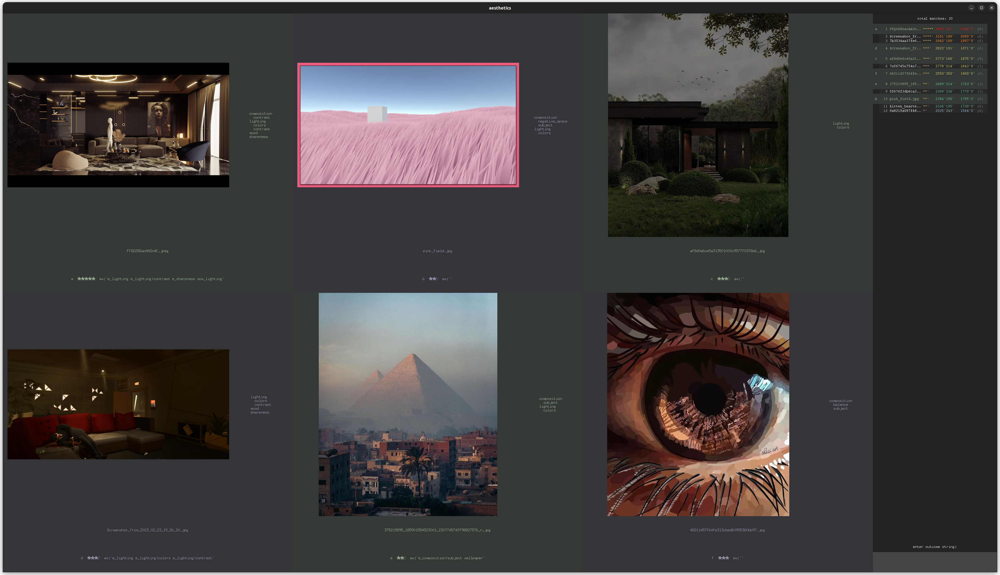

# aesthetics exploration

***Aesthetics*** is the theory of art and beauty, in particular the question of what makes something beautiful or interesting to regard.<br>
This project is an advanced media [img/video] organizer tool that automates the whole pipeline:

- monitoring the configured folder for freshly downloaded files
- triggering a helper to tag, rate, add notes to files, and automatically move them to your library
- a search tool with non-trivial query language
- match mode to refine the ratings precision using Glicko and ELO algorithms
- redundantly saving metadata both in files as XMP, and in a local database, along with match history in case of data corruptions
- stats tool to monitor integrity of the library and looking for insights
- attemps at different kinds of machine learning algorithms to predict tags and ratings [essentially, understanding your taste]
- after success in the previous step - scrape web for new media and recommend the best candidates

**Note: everything is done offline, no data is being collected**



## Quick start

1) configure `src/downcfg.py`:

    - `buffer_dir`: the dir with yet-to-be-categorized files.
    - `uncateg_dir`: a utility dir where problematic files are moved - e.g. they don't support metadata, have unknown extension etc.
    - `dest_dir`: the main dir of your library

2) configure `src/tags_vocab.py`:

    - `VOCAB` is the list of all possible tags for your library. Tags can be hierarchical using the `|` symbol - e.g. `composition|negative_space`, `composition|frames` etc. Suggested usage is to tag everything you find particularly appealing about the mediafile - color combinations, theme, main subject etc.
    - `SPECIAL_AWARDS` [optional] - the software allows a free-form text metadata for each file, use it as you want. Suggested usage: add `e_{tag}` to signify an exemplary instance of a particular tag.

3) to categorize new files, run

    ```bash
    src/down.py [N]
    ```

    If you leave it running, it will monitor the specified folder for any new files and give you `N+1` files to categorize on each dir update. Suggested usage: run `src/down.py 0` every time you go to download new media for your collection. Each download will automatically open up the categorizer helper.

4) to search your library, run

    ```bash
    src/ae_rater.py --search [dir] [n]
    ```

    Then enter the search query on the bottom right [more about search queries below]. Use Up/Down arrows to naviage results pages.

5) to run the match mode, run

    ```bash
    src/ae_rater.py [--refresh] [dir] [n]
    ```

    Then enter the match result on the bottom right [more about match results below].
    Note that you can optionally run `--refresh` once to incorporate all newly categorized files.

6) to visualize library statistics and run health checks, dive into `src/folder_stats.ipynb`

## User Input

### Search query language

Files are filtered on all the metadata: filename, rating, tags, special_awards etc.

Enter keywords to filter files containing all of them [multiple words are interpreted as AND]:
```
jpg composition 5
```
will display jpegs that have `composition` and `5` anywhere in their metadata

For an OR operation, use `|`:
```
jpg composition | mp4 color | contrast
```
will display jpegs tagged with `composition`, alongside videos tagged `color`, alongside any files tagged `contrast`.

For negation, use `-` prefix:
```
jpg -color
```
will display all jpegs that *are not* tagged with `color`.

### Match outcome language

Each match participant has their own letter a-z [ordered left-right top-bottom].
The identifying letter can be seen below every file, as well as in the leaderboard on the right.
Match outcome is a string consisting of lowercase letters, spaces and modifiers.
In the basic form, the user inputs the letters in the order of aesthetic preference.

For example, if there are 6 files in a match, they have identifiers a-f.
```
b d a c f e
```
means the user prefers the item `b` most, then `d`, ... and `e` is his least favorite.

If the user cannot choose order between some items, he can group them without spaces:
```
bd a cfe
```
means `b` and `d` are preferrable to all the rest, but are incomparable between themselves. `c`, `f`, `e` are incomparable among themselves, but are less preferrable than all the rest.

The user can also express some extra sentiment towards specific items by following their identifying letters with [possibly several] `+` or `-`:
```
b+++d+ a- cf-e
```
means the user wants to give `b` a sizeable boost in rating, `d` a small boost, and he wants to decrease the ratings of `a` and `f` slightly.


## Slow start

1) To see all the up-to-date options, run

    ```bash
    src/ae_rater.py --help
    ```

2) If that's your thing, dig into tests with

    ```bash
    python -m unittest
    ```

3) You can train your own CNN to recognize tags from your media library, and plug it into this project (`src/ai_backend_tags.py`). That way the categorize helper would automatically apply tags it's confident about, significantly speeding up the tagging process.

## TODO

### short-term

- move vocabulary to the target media folder, or provide link to it in cfg file
- group similar items, finding balance between two crucial points:
  a: avoid oversaturation of close things
  b: but simultaneously preserve the important differences/elements
  ideas:
  - maybe create an unrated folder with all the possible variations - to help ML - violates 'b'
  - maybe combine into groups, and rate/compare/meta the whole group - violates 'b'
    would be cool to have general meta shared by the group and some unique for each media

### long-term

- improve performance
- learn to predict rating
- scrape web for new media, predict ratings and show the most promising candidates
  - scrape reverse-search img from the higest rated
- learn the overall/specific styles and generate new media with smth like stable diffusion

### Dev notes on machine learning attempts

- simple CNN didn't learn rating from imgs, can learn tags but most experiments overfitted
- random forest from tags didn't learn rating
- tried using nearest neighbors to predict rating from tags, got sqrt(mse)=600
